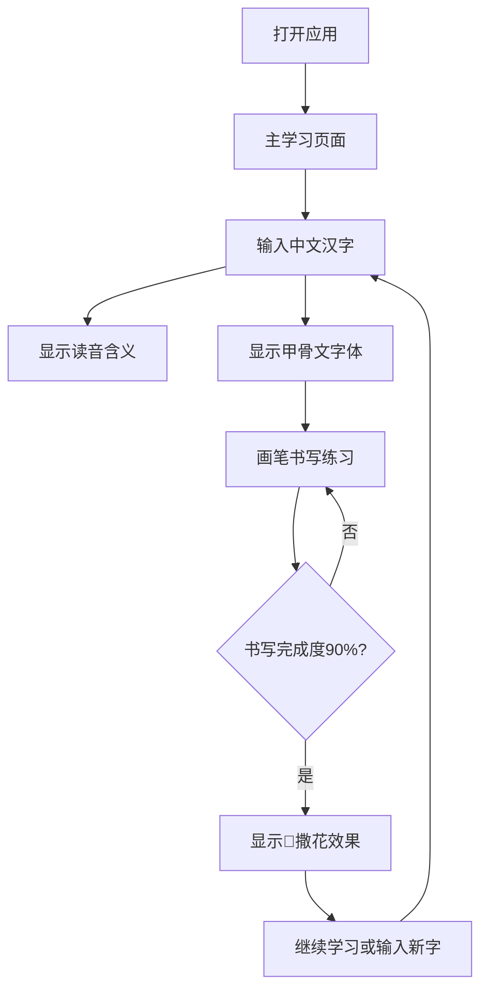

# 甲骨文学习应用产品需求文档

## 1. Product Overview
甲骨文学习应用是一款专注于中国古代文字学习的交互式教育应用，通过现代化的界面设计和书写体验，帮助用户学习和练习甲骨文字。
- 解决传统甲骨文学习缺乏互动性和趣味性的问题，为文字爱好者、学生和研究者提供沉浸式的学习体验。
- 目标是成为甲骨文数字化学习的领先平台，推广中华传统文化。

## 2. Core Features

### 2.1 User Roles
本应用为单用户模式，无需区分用户角色，所有用户均可直接使用全部功能。

### 2.2 Feature Module
甲骨文学习应用包含以下主要页面：
1. **主学习页面**：文字信息展示区、文本输入区、甲骨文书写画布区

### 2.3 Page Details

| Page Name | Module Name | Feature description |
|-----------|-------------|---------------------|
| 主学习页面 | 文字信息展示区 | 显示汉字读音、含义解释，字体大小24px，提供清晰的文字学习信息 |
| 主学习页面 | 文本输入区 | 提供文本输入框，用户可输入中文汉字进行甲骨文转换和学习 |
| 主学习页面 | 甲骨文画布区 | 龟甲背景的canvas画布，显示输入汉字对应的甲骨文字体，字体颜色为慢慢闪动的中性灰色，充满整个画面 |
| 主学习页面 | 书写功能 | 提供纯黑色画笔，在甲骨文字体上书写为黑色，字体外无颜色显示 |
| 主学习页面 | 完成提示 | 当90%字体完成书写时显示🎉撒花完成效果 |

## 3. Core Process
用户操作流程：
1. 用户打开应用进入主学习页面
2. 在文本输入框中输入想要学习的中文汉字
3. 系统在文字信息展示区显示该汉字的读音和含义
4. 甲骨文画布区自动显示对应的甲骨文字体，以闪动的中性灰色充满画面
5. 用户使用画笔在甲骨文字体上进行书写练习
6. 当书写完成度达到90%时，系统显示🎉撒花完成效果

## 4. User Interface Design

### 4.1 Design Style
- **主色调**：深棕色(#8B4513)和米黄色(#F5DEB3)，营造古朴典雅的文化氛围
- **辅助色**：中性灰色(#808080)用于甲骨文字体显示
- **按钮样式**：圆角矩形，具有古典文化元素
- **字体**：优先使用方正甲骨文字体，备选华康甲骨文和中研院字体
- **布局风格**：上下分区布局，顶部信息区域，下方画布区域
- **图标风格**：采用中国传统文化元素，如印章、毛笔等图标

### 4.2 Page Design Overview

| Page Name | Module Name | UI Elements |
|-----------|-------------|-------------|
| 主学习页面 | 文字信息展示区 | 24px字体大小，深棕色文字，米黄色背景，居中对齐布局 |
| 主学习页面 | 文本输入区 | 圆角边框输入框，占据顶部区域1/3宽度，古典样式边框 |
| 主学习页面 | 甲骨文画布区 | 龟甲纹理背景，全屏canvas，甲骨文字体以中性灰色闪动效果显示 |
| 主学习页面 | 画笔工具 | 纯黑色(#000000)画笔，笔触粗细可调，仅在字体区域显示颜色 |
| 主学习页面 | 完成效果 | 🎉撒花动画效果，配合传统庆祝音效 |

### 4.3 Responsiveness
应用采用移动端优先设计，完全适配手机和平板设备：
- 支持触摸交互，优化手指书写体验
- 响应式布局，自动适应不同屏幕尺寸
- 画布区域支持多点触控和手势操作
- 字体大小和界面元素根据设备屏幕自动缩放