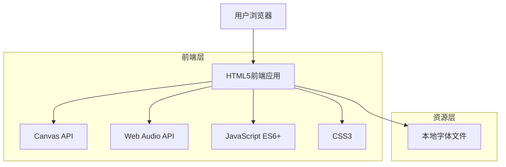
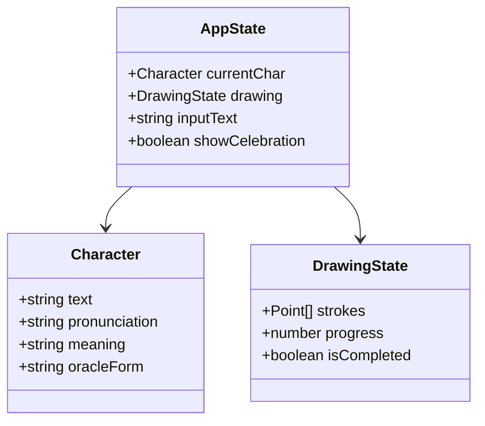

# 甲骨文学习应用技术架构文档

## 1. Architecture design



## 2. Technology Description

- Frontend: 原生HTML5 + JavaScript ES6+ + CSS3 + Canvas API
- Backend: None (纯前端应用)
- 字体资源: 本地TTF字体文件
- 动画: CSS3 Animations + Canvas动画

## 3. Route definitions

| Route | Purpose |
|-------|----------|
| / | 主学习页面，包含文字显示、输入和甲骨文书写画布 |

## 4. API definitions

本应用为纯前端应用，无需后端API。主要使用以下前端API：

### 4.1 Core APIs

**Canvas绘制API**
```javascript
class CanvasDrawing {
  drawOracleText(text, x, y) { /* 绘制甲骨文字体 */ }
  drawBrushStroke(points) { /* 绘制笔画路径 */ }
  clearCanvas() { /* 清空画布 */ }
  getWritingProgress() { /* 获取书写进度 */ }
}
```

**字体加载API**
```javascript
class FontLoader {
  async loadFont(fontPath) { /* 加载字体文件 */ }
  getFontPriority() { /* 获取字体优先级 */ }
  checkFontAvailability(fontName) { /* 检查字体可用性 */ }
}
```

**文字信息API**
```javascript
class CharacterInfo {
  getCharacterInfo(char) {
    return {
      pronunciation: '', // 读音
      meaning: '',       // 含义
      oracleForm: ''     // 甲骨文形态
    };
  }
}
```

## 5. Data model

### 5.1 Data model definition

本应用主要使用前端状态管理，无需数据库。主要数据结构如下：



### 5.2 Data Definition Language

**字符信息数据结构**
```javascript
// 字符信息对象
class Character {
  constructor(text, pronunciation, meaning, oracleForm) {
    this.text = text;           // 汉字文本
    this.pronunciation = pronunciation;  // 读音
    this.meaning = meaning;     // 含义
    this.oracleForm = oracleForm;    // 甲骨文形态
  }
}

// 绘制状态对象
class DrawingState {
  constructor() {
    this.strokes = [];      // 笔画路径点数组
    this.progress = 0;      // 书写进度 (0-100)
    this.isCompleted = false;  // 是否完成
  }
}

// 坐标点对象
class Point {
  constructor(x, y, pressure = null) {
    this.x = x;
    this.y = y;
    this.pressure = pressure;     // 压感（可选）
  }
}

// 应用状态管理
class AppState {
  constructor() {
    this.currentChar = null;      // 当前字符
    this.drawing = new DrawingState();  // 绘制状态
    this.inputText = '';          // 输入文本
    this.showCelebration = false; // 显示庆祝效果
    this.fontLoaded = false;      // 字体加载状态
  }
}

// 字体配置
const FONT_CONFIG = {
  primary: '/Users/easyo/Documents/trae_projects/oracle/fonts/FangZhengOracle.ttf',
  secondary: '/Users/easyo/Documents/trae_projects/oracle/fonts/HYChenTiJiaGuWen.ttf',
  tertiary: '/Users/easyo/Documents/trae_projects/oracle/fonts/ZhongYanYuan.ttf'
};

// 样式配置
const STYLE_CONFIG = {
  fontSize: 24,
  oracleColor: '#808080',
  brushColor: '#000000',
  backgroundColor: '#F5DEB3',
  completionThreshold: 0.9
};
```